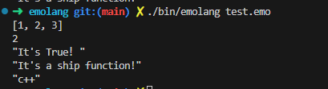

# Emolang

emoji lang in development


```
💬 [1, 2, 3]

❓ 1 < 2 ▶️
    💬 2
⏹️

❓ ✅ ▶️
    💬 "It's True！"
⏹️

🧮 :🚢 ▶️
    💬 "It's a ship function!"
⏹️

🚢


🧮 :➕➕ ▶️ |name|
    💬 "#{name}++"
⏹️

➕➕ "c"
```

## Run result:
